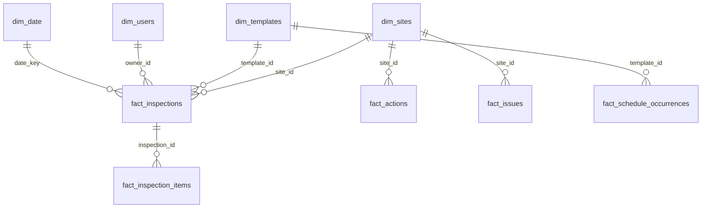

# Export to Power BI, Qlik or Excel

`sc_export_bi_bundle` writes a ready-to-load star schema from the local cache to a folder under `~/.safetyculture-mcp/exports/`. Ask your assistant: *"Export a BI bundle for the last 12 months."*

## What is in the folder
| File | Grain | Keys |
|---|---|---|
| `fact_inspections.csv` | one row per inspection (archived and incomplete included) | `inspection_id`; `site_id`, `template_id`, `owner_id`, `date_key` |
| `fact_inspection_items.csv` | one row per item (question, section, field) of each inspection, with failed flag and score | `inspection_item_id`; `inspection_id` |
| `fact_actions.csv` | one row per action | `action_id`; `site_id`, `inspection_id` (optional), `date_key` |
| `fact_issues.csv` | one row per issue | `issue_id`; `site_id`, `category_id`, `date_key` |
| `fact_schedule_occurrences.csv` | one row per scheduled occurrence per assignee (as the scheduling feed returns it) | `occurrence_row_id`; `template_id`, `date_key` |
| `dim_sites.csv` | one row per site or hierarchy level (deleted included) | `site_id`, `parent_site_id` |
| `dim_templates.csv`, `dim_users.csv` | one row per template / user | `template_id`, `user_id` |
| `dim_date.csv` | one row per UTC calendar day | `date_key` (integer YYYYMMDD) |
| `manifest.json` | grains, keys, relationships, row counts, `as_of` | |
| `powerbi.pq` | Power Query (M) script that loads the folder | |
| `qlik.qvs` | Qlik Sense load script | |
| `README.md` | loading steps for that bundle | |

Row counts in `manifest.json` always equal the rows in each CSV (this is tested). User names and emails follow the server's privacy level (`SC_PII`).

## Power BI
1. Open Power BI Desktop, **Get data > Blank query > Advanced editor**.
2. Paste `powerbi.pq`, set the folder path at the top, and load.
3. Relationships are listed in comments at the top of the script. The links from actions, issues and occurrences back to inspections are created inactive so there is only one filter path from sites; use `USERELATIONSHIP` in measures when you need them.

## Qlik Sense
1. Create a folder data connection pointing at the bundle folder.
2. Paste `qlik.qvs` into the load script and set the connection name.
3. The four fact tables are concatenated into one `Facts` table with a `fact_type` field, which avoids synthetic keys and loops. Inspection items link on `inspection_id`.

## Excel
Open any CSV directly. Cells that begin with `=`, `+`, `-` or `@` are prefixed with an apostrophe, so record text can never run as a formula.

## Single tables
`sc_export_dataset` exports one cached feed (or a filtered subset by period, site and template) to CSV or JSONL, for quick analysis without the full model.
